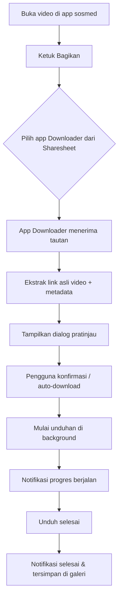
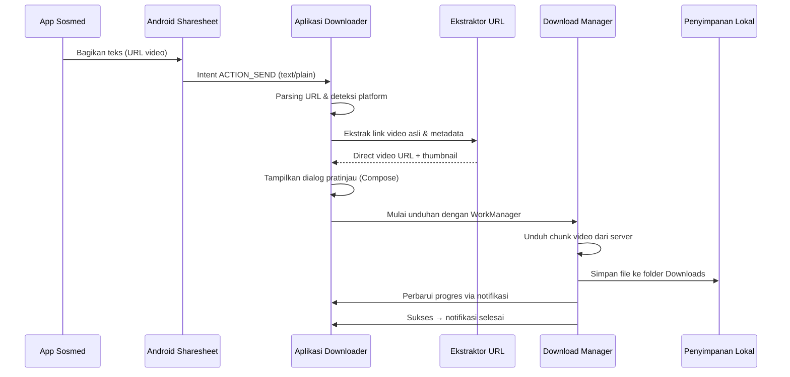
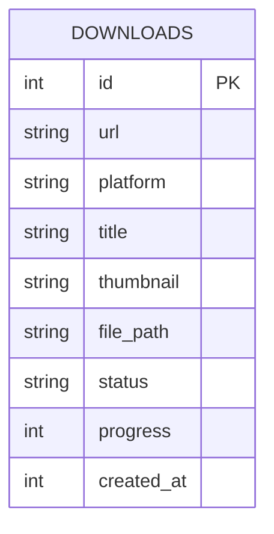

# PRD — Project Requirements Document

## Overview
Aplikasi ini menjawab masalah pengguna yang ingin menyimpan video dari TikTok, Instagram, atau Facebook ke perangkat Android tanpa repot menyalin dan menempelkan tautan. Dengan meniru alur berbagi (share) yang sudah dikenal di iOS seperti aplikasi “R Download”, pengguna cukup menekan tombol “Bagikan” di aplikasi media sosial, memilih aplikasi ini dari daftar, dan video otomatis terdeteksi serta diunduh. Tujuan utamanya adalah memberikan pengalaman semulus mungkin—tidak ada salin tautan, tidak ada tempel, cukup satu ketukan.

## Requirements
- **Sistem Operasi:** Android 8.0 (API 26) atau lebih tinggi (menyesuaikan fitur Sharesheet modern).
- **Izin Aplikasi:**
  - Akses internet (`INTERNET`) untuk mengambil konten video.
  - Izin penyimpanan (`WRITE_EXTERNAL_STORAGE` / `READ_EXTERNAL_STORAGE`, atau Scoped Storage untuk Android 11+) agar dapat menyimpan file unduhan.
  - Opsional: izin notifikasi agar dapat menampilkan progres pengunduhan.
- **Kemampuan Teknis:**
  - Menerima intent `ACTION_SEND` dengan tipe `text/plain` dari fitur Bagikan (Sharesheet) Android.
  - Mengekstrak URL media dari teks yang dikirimkan.
  - Mendeteksi platform (TikTok, Instagram, Facebook) berdasarkan pola URL atau metadata yang disertakan.
  - Mengunduh video melalui protokol HTTP/HTTPS dengan dukungan resume dan background download.
  - Menyimpan video ke penyimpanan lokal dan menampilkannya di galeri aplikasi.
- **Non-Fungsional:**
  - Kecepatan reaksi: aplikasi harus terbuka dan mulai memproses tautan dalam waktu < 2 detik setelah dipilih dari Sharesheet.
  - Ukuran unduhan: menangani video hingga 500 MB.
  - Pengalaman offline: unduhan yang gagal karena jaringan harus dapat dilanjutkan secara otomatis.

## Core Features
- **Tangkapan Bagikan Satu Ketuk** – Menerima share intent dari aplikasi TikTok, Instagram, atau Facebook dan langsung memulai proses.
- **Ekstraksi Cerdas** – Mengenali link media sosial, mengambil metadata (judul, thumbnail), dan menyiapkan link unduhan sebenarnya (direct video URL).
- **Unduhan Latar Belakang** – Menggunakan WorkManager agar unduhan tetap berjalan meski aplikasi ditutup, disertai notifikasi progres dan kontrol jeda/lanjutkan.
- **Riwayat & Galeri** – Menampilkan semua video yang pernah diunduh dalam tampilan grid/koleksi lokal, lengkap dengan info sumber dan tanggal.
- **Pratinjau Sebelum Unduh (opsional)** – Dialog mini setelah share untuk menampilkan judul, thumbnail, dan tombol “Unduh” / “Batal”, sehingga pengguna bisa memutuskan tanpa membuka aplikasi penuh.
- **Pendeteksian Otomatis Platform** – Tidak perlu memilih platform; aplikasi langsung mengarahkan ke parser yang tepat.

## User Flow
1. Pengguna membuka video di TikTok/Instagram/Facebook.
2. Mengetuk tombol **Bagikan** dan memilih **Aplikasi Downloader** dari daftar Sharesheet Android.
3. Aplikasi Downloader langsung terbuka (mungkin hanya muncul dialog apung atau layar penuh ringkas).
4. Tautan video diekstrak, dan dialog **Pratinjau** singkat muncul menampilkan judul dan thumbnail.
5. Pengguna mengetuk **Unduh** (atau aplikasi langsung otomatis memulai setelah 3 detik tanpa input).
6. Unduhan dimulai di latar belakang; sebuah notifikasi “Sedang mengunduh…” muncul di bilah status.
7. Setelah selesai, notifikasi berubah menjadi “Video selesai”; pengguna dapat membuka video dari galeri aplikasi atau folder Download perangkat.

Diagram alir pengguna:

## Architecture
Aplikasi mengikuti arsitektur MVVM (Model-View-ViewModel) berbasis Jetpack Compose untuk UI dan Room untuk data lokal. Aliran utama digerakkan oleh intent system dan diproses oleh service latar belakang.

Sequence diagram interaksi saat pengguna membagikan tautan:

## Database Schema
Database lokal menggunakan Room untuk melacak riwayat unduhan dan preferensi sederhana.

### Tabel: `downloads`
| Kolom       | Tipe    | Keterangan                         |
|-------------|---------|------------------------------------|
| `id`        | INTEGER (PK, autoGenerate) | ID unik unduhan |
| `url`       | TEXT    | URL video asli yang dibagikan      |
| `platform`  | TEXT    | Nama platform (TIKTOK, INSTAGRAM, FACEBOOK) |
| `title`     | TEXT    | Judul atau deskripsi video (nullable) |
| `thumbnail` | TEXT    | Path lokal thumbnail (jika diunduh) |
| `file_path` | TEXT    | Path lengkap video yang sudah disimpan |
| `status`    | TEXT    | Status unduhan: QUEUED, DOWNLOADING, COMPLETED, FAILED |
| `progress`  | INTEGER | Persentase progres (0-100)        |
| `created_at`| INTEGER (UNIX timestamp) | Waktu unduhan dimulai |

Diagram relasi (sederhana, hanya satu tabel):

## Tech Stack
- **Bahasa & Framework UI:** Kotlin, Jetpack Compose (UI deklaratif modern untuk Android)
- **Arsitektur:** MVVM dengan StateFlow / LiveData
- **Database Lokal:** Room (abstraksi SQLite)
- **Background Task:** WorkManager + Foreground Service untuk unduhan tahan latar
- **Network:** Ktor (atau Retrofit + OkHttp) untuk HTTP request / download streaming
- **Ekstraksi Video:** Library custom berbasis reguler expression dan parser site-specific, dukungan untuk TikTok, Instagram, Facebook (dapat menggunakan API publik atau headless browser WebView jika diperlukan)
- **Notifikasi:** NotificationCompat + Channel API
- **Penyimpanan:** Scoped Storage APIs (`MediaStore` atau `SAF`)
- **DI:** Hilt (Dagger-based dependency injection)
- **Build System:** Gradle dengan Kotlin DSL
- **Target Minimum:** Android 8.0 (API 26), Target SDK terbaru (33+) untuk dukungan Sharesheet maksimal